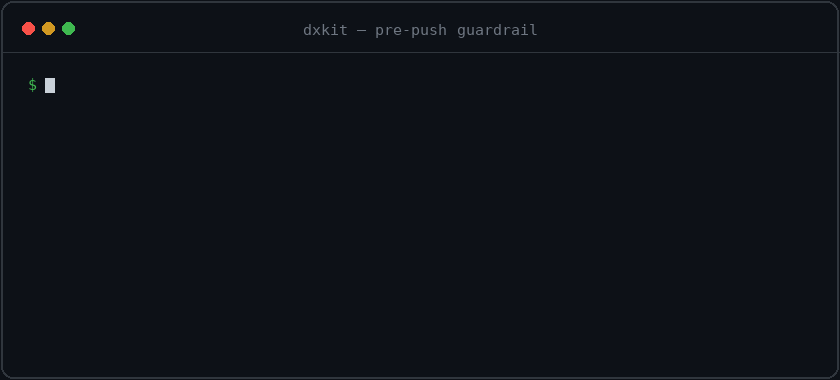

# dxkit

**AI writes the code. dxkit helps ship it clean.**

_Deterministic guardrails for any codebase. Brownfield-friendly by default._

dxkit scores your codebase deterministically, baselines today's findings, and gates every push against net-new regressions. It ships conversational skills that walk agents (and humans) through fixes. Existing tech debt stays grandfathered. Nothing runs on an LLM. Everything runs locally.

<p align="center">
  
</p>

```bash
npm init @vyuhlabs/dxkit
```

<p>
  <a href="https://www.npmjs.com/package/@vyuhlabs/dxkit">
    
  </a>
  
  
  
  
</p>

---

## The problem

Codebases drift downward in slow ways that tests do not catch.

A typical Friday. Your team ships a fix. CI passes. Review approves. Two weeks later, an auditor finds a new hardcoded secret in the diff, three new untested branches, and a previously-clean file that grew to 800 lines with three TODOs sprinkled in. None of it failed a test, because no test covered those things.

Now multiply this by every AI agent your team uses. Agents write more code than humans can review. Some of it is fine. Some of it is slop that looks fine but quietly degrades the codebase.

The conventional fix is "block any new finding via static analysis." That fails on real codebases for a predictable reason:

- Block every finding, and your 5-year-old repo lights up with hundreds of pre-existing issues. The team disables the gate within a week.
- Block no findings, and the gate is theater. Nothing changes.

You need an objective gate that only fires on what is actually new. That is the gap dxkit fills.

---

## How dxkit solves it

Three ideas working together.

### 1. Capture today's state as a baseline

Before dxkit blocks anything, it snapshots every existing finding in your repo and fingerprints them. The fingerprints survive renames, line shifts from formatter runs, and small unrelated edits. Cross-tool overlaps (gitleaks and semgrep flagging the same line) collapse to one finding.

From this moment forward, the gate only fires on net-new regressions. Your existing debt is grandfathered. The team fixes old issues at their own pace. The gate stays useful because it stays reasonable.

Three modes for the baseline file:

- `committed-full`: rich entries committed to git. Default for private repos.
- `committed-sanitized`: stripped to fingerprint plus kind. For compliance-conscious teams.
- `ref-based`: no committed file at all. Prior side recomputed from a git ref via `git worktree add`. Default for public repos. Zero disclosure surface.

### 2. Score the codebase deterministically

dxkit produces a 0 to 100 score across six dimensions: Security, Code Quality, Tests, Documentation, Maintainability, Developer Experience.

The score has four properties:

| Property              | What it means                                                                                                                                                                                                          |
| --------------------- | ---------------------------------------------------------------------------------------------------------------------------------------------------------------------------------------------------------------------- |
| **Deterministic**     | Same code yields the same score every time. No LLM in the grading path. Reproducible across machines, runs, and CI. Auditable.                                                                                         |
| **Comparable**        | Two codebases of similar quality produce similar scores. Surface tricks do not move the needle. Adding empty comments does not improve Documentation if the code is not actually documented.                           |
| **Severity-weighted** | A critical security finding moves the score far more than a TODO comment. Penalties are anchored to real-world impact via CVSS for security and ratio thresholds for tests, coverage, file size, and other dimensions. |
| **Actionable**        | Every deduction names the file, the line, and the recommended fix. Output is structured JSON. Agents and humans read the same thing. The "what to do next" lives in the score itself.                                  |

### 3. Fix findings at reduced token cost

Detection is only half the job. dxkit builds a deterministic code graph of the repo (its symbols, call edges, and clustered modules), so fixing is cheap too. A coding agent works from that structure ("what calls this? what breaks if I change it?") instead of re-reading whole files, and every finding in a detailed report already carries its blast radius: the files that depend on it. The `dxkit-action` skill runs the fix, re-scores, and confirms the gate clears. Same result, far fewer tokens.

### What you get from the combination

A score on its own is a number. A baseline on its own grandfathers the past. Together they produce an objective stop signal you can trust.

```text
Today:    16/100 E      644 findings, all baselined
Next PR:  16/100 E      644 persisted, 0 new. Gate passes.
Bad PR:   14/100 E      644 persisted, 2 new high-severity. Gate blocks.
```

The score does not lie. The baseline keeps it useful on real codebases. The combination works the same for humans, AI agents, and CI runners. That is the part that scales. And once the gate fires, the code graph makes acting on it cheap: agents fix from the structure rather than reading file after file.

---

## 60-second demo

```text
$ npm init @vyuhlabs/dxkit
✓ Created: 14 files
✓ Git hooks: installed 1 file(s)
    .githooks/pre-push
✓ Devcontainer: installed 3 file(s)
✓ CI guardrails workflow: installed 1 file(s)
    .github/workflows/dxkit-guardrails.yml
✓ Done! Claude Code now has full project context.
→ Next: run `vyuh-dxkit baseline create` to capture today's state.

$ npx vyuh-dxkit baseline create
→ Baseline mode=committed-full (auto: visibility not detectable via gh; defaulting to private posture)
✓ Wrote .dxkit/baselines/main.json — 644 findings, salt: deterministic (208.9s)

$ npx vyuh-dxkit guardrail check
## Guardrail: PASSED
No changes from baseline (644 pairs checked).
```

Later, an innocent-looking PR slips in a regression. The pre-push hook fires:

```text
$ git push
[hook] vyuh-dxkit guardrail check
## Guardrail: BLOCKED
2 new regressions found.

| Status | Kind | Severity | Location | Reason |
|---|---|---|---|---|
| added | secret | high | src/config/secrets.ts:42 | gitleaks/aws-access-key |
| added | code | medium | src/handlers/exec.ts:17 | semgrep/eval-use |

644 pre-existing findings persisted. Only the new changes blocked you.
Fix or allowlist with `npx vyuh-dxkit allowlist add ...`
```

The 644 pre-existing findings sit quietly. The 2 net-new ones stop the push.

---

## Features

### Eight first-class language packs

TypeScript / JavaScript, Python, Go, Rust, C# / .NET, Java, Kotlin, Ruby. Each pack ships per-ecosystem analyzers: semgrep rulesets, dep-vuln scanners, license tools, lint adapters. Polyglot repos get unified reports without configuration.

<details>
<summary><strong>Per-pack capabilities</strong> (click to expand)</summary>

| Language | Detection                             | Coverage import     | Import-graph                                 | Native tools                        | Lint severity tiers    | Vuln severity tiers                           |
| -------- | ------------------------------------- | ------------------- | -------------------------------------------- | ----------------------------------- | ---------------------- | --------------------------------------------- |
| TS / JS  | `package.json`                        | ✅ Istanbul         | ✅ import/require/re-export                  | eslint, npm audit, vitest-coverage  | ✅ ESLint rule ID      | ✅ npm audit native                           |
| Python   | `pyproject.toml`, `setup.py`, `*.py`  | ✅ coverage.py      | ✅ import/from                               | ruff, pip-audit, coverage           | ✅ ruff code prefix    | ✅ pip-audit + OSV.dev (CVSS v3+v4)           |
| Go       | `go.mod`                              | ✅ coverprofile     | ✅ import blocks                             | golangci-lint, govulncheck          | ✅ `FromLinter` family | ✅ govulncheck embedded + OSV.dev             |
| Rust     | `Cargo.toml`                          | ✅ lcov + cobertura | ⚠️ use statements, extracted only¹           | clippy, cargo-audit, cargo-llvm-cov | ✅ clippy group        | ✅ cargo-audit native                         |
| C#       | `*.csproj`, `*.sln`                   | ✅ cobertura XML    | ⚠️ using declarations, extracted only¹       | dotnet-format (formatter)           | ⚠️ format-only²        | ✅ dotnet list --vulnerable                   |
| Kotlin   | gradle/`*.gradle{.kts,}`, `*.kt`      | ✅ JaCoCo XML       | ⚠️ import statements, extracted only¹        | detekt, osv-scanner (Maven)         | ✅ detekt severity     | ✅ osv-scanner + OSV.dev (Maven)              |
| Java     | `pom.xml`, `src/main/java/`, `*.java` | ✅ JaCoCo XML       | ⚠️ import statements, extracted only¹        | PMD, osv-scanner (Maven)            | ✅ PMD priority tiers  | ✅ osv-scanner + OSV.dev (Maven)              |
| Ruby     | `*.rb`                                | ✅ SimpleCov JSON   | ⚠️ require/require_relative, extracted only¹ | rubocop, bundler-audit, osv-scanner | ✅ rubocop severity    | ✅ bundler-audit + osv-scanner (Gemfile.lock) |

¹ Rust, C#, Kotlin, Java, and Ruby populate `imports.extracted` but the
file-level resolver is a no-op. Downstream analyses that need an edge graph
(reachability, import-graph test-gap credit) degrade to conservative
defaults for those packs. Resolvers are tracked on the [roadmap](docs/roadmap.md).

² C# uses `dotnet-format` for formatting violations only. A real
severity-tiered C# linter (Roslyn analyzers or StyleCop) is on the
roadmap. Today every C# formatting violation is counted at `low` tier
so it does not inflate the Code Quality score.

</details>

### The matcher

Multi-axis fingerprints (location, domain, content, semantic) pair findings across runs even when files were renamed, lines shifted, tools changed versions, or the branch was force-pushed. When location fails, the matcher falls back to git-aware diff lookup, then content hash, then identity-only multiset match. Every pair carries a confidence score and a reason chain.

### Per-finding suppression

Five typed categories: `false-positive`, `test-fixture`, `mitigated-externally`, `accepted-risk`, `deferred`. Each entry requires a reason. Categories that fade over time require an expiry.

Two surfaces:

- Inline annotations: `// dxkit-allow:test-fixture reason="example placeholder"`
- File-level: `.dxkit/allowlist.json`, audited via `vyuh-dxkit allowlist audit`

Orphaned annotations become their own findings. The TypeScript `@ts-expect-error` model applied to suppressions. Prevents the graveyard of stale allowlist entries.

### AI-agent integration

dxkit ships twelve Claude Code skills under `.claude/skills/dxkit-*`. They wrap the CLI in conversational flows:

| Skill                                                                                                     | What it does                                                            |
| --------------------------------------------------------------------------------------------------------- | ----------------------------------------------------------------------- |
| `dxkit-onboard`                                                                                           | Walks a customer through the full first-install journey                 |
| `dxkit-reports`                                                                                           | Runs analyzers and explains the output                                  |
| `dxkit-action`                                                                                            | Reads a report, prioritizes findings, plans and runs fixes, re-verifies |
| `dxkit-ingest`                                                                                            | Brings external SAST findings (Snyk Code, CodeQL, SARIF) into dxkit     |
| `dxkit-fix`                                                                                               | Repairs a broken install from doctor output                             |
| `dxkit-feature`, `dxkit-docs`, `dxkit-hooks`, `dxkit-config`, `dxkit-learn`, `dxkit-update`, `dxkit-init` | Focused flows                                                           |

`AGENTS.md` (the open standard read by Codex, Cursor, Aider, and others) also ships in every install. The skill flows are Claude Code-specific today; the AGENTS.md context is portable.

Why this matters for AI workflows: when an agent fixes a bug, you need an objective signal that says "yes, fixed cleanly" or "fix introduced four new regressions." dxkit's deterministic score plus baseline guardrail produces that signal. The agent reads the same JSON envelope a human reads, runs the verify step itself, and stops when clean.

### Code-graph context: fix at reduced token cost

dxkit builds a deterministic code graph of your repo (its symbols, call edges, and clustered modules) using graphify (the `graphifyy` Python package). What matters is what an agent does with it. Instead of discovering structure by grepping around and reading whole files, the agent gets just the relevant slice:

- **`vyuh-dxkit context <query>`** (and an opt-in PreToolUse hook) hand an agent a slim structural map: the relevant symbols, where they live, and what calls them. It navigates by the graph instead of re-reading files, which is the same work at a fraction of the tokens.
- **`--graph-context`** writes each finding's module and blast radius (which files call into it) straight into the detailed report, so the `dxkit-action` fix skill can plan the change, and know which callers to re-test, without rediscovering structure first.
- **`vyuh-dxkit explore`** and a dashboard graph tab let humans ask the same graph what the repo does, where a feature lives, and which files are load-bearing.

This is an additive, fail-open layer. When the graph is missing, or a language's call edges can't be resolved, every command behaves exactly as it did before. It's reliable on TypeScript, Python, and Go. Where the call graph can't be resolved (C#), blast radius is suppressed rather than faked, so a "no callers" reading is never mistaken for "safe to change."

### Deep SAST: interprocedural findings from any engine

dxkit's bundled SAST (community semgrep) is intraprocedural — it can't follow tainted data across function boundaries, so it misses the path-traversal / information-exposure / SSRF / injection class that an interprocedural engine like Snyk Code or CodeQL catches. dxkit doesn't try to re-detect that class; it **ingests** it and makes it first-class.

- **`vyuh-dxkit ingest --from-snyk`** reads your Snyk Code findings via the REST API (no Snyk test quota consumed — it reads stored results). **`--sarif <file>`** ingests SARIF from any engine; **`--codeql`** runs CodeQL on demand (open-source / GitHub Advanced Security).
- Ingested findings enter the same pipeline as native ones: fingerprinted and deduped, written to the baseline, enforced by the guardrail, and graph-linked under `--graph-context` so the `dxkit-action` fix loop sees blast radius + callers — context the source engine's own autofix doesn't have.
- The findings live in a committed `.dxkit/external/` snapshot, so the engine token is needed only at ingest time (ideally one on-demand CI job) — every developer and CI run reads the snapshot without it.

dxkit isn't competing with the detection engine — it's the governance + agentic-fix layer on top of whichever one you can run. The `dxkit-ingest` skill walks through setup and picks the engine license-aware (your own Snyk for private repos; CodeQL for open source / GHAS).

### Reproducible environments

Per-stack devcontainer with only the languages your project uses. Scanner toolchain auto-installed. Install scripts for AI agent CLIs (auth stays user-owned). Codespaces prebuilds wire via `vyuh-dxkit setup-prebuild` so cold-start drops from ~7 minutes to ~30 seconds.

### Public-repo safe baselines

The `ref-based` mode commits no baseline file. The guardrail check recomputes the prior side at check time from a git ref via `git worktree add`. Zero disclosure surface. File paths, package names, and advisory IDs all stay out of git. Auto-picked for public repos via `gh repo view --json visibility`.

---

## Quickstart

```bash
# Canonical first install
npm init @vyuhlabs/dxkit

# Capture today's state
npx vyuh-dxkit baseline create

# Verify the install
npx vyuh-dxkit doctor

# Commit and ship
git add . && git commit -m "chore: enable dxkit" && git push

# Optional but recommended
npx vyuh-dxkit setup-branch-protection   # mark guardrail as required CI check
npx vyuh-dxkit setup-prebuild            # Codespaces prebuild
```

À la carte if you only want specific pieces:

```bash
npx vyuh-dxkit init --with-dxkit-agents       # just the twelve Claude skills + AGENTS.md
npx vyuh-dxkit init --with-hooks              # just the pre-push hook
npx vyuh-dxkit init --with-precommit-hook     # add pre-commit (slow on large repos)
npx vyuh-dxkit init --with-devcontainer       # just the per-stack devcontainer
npx vyuh-dxkit init --with-ci                 # just the PR-gate workflow
```

---

## What dxkit analyzes

| Dimension            | Tools                                                                                                           | What it catches                                               |
| -------------------- | --------------------------------------------------------------------------------------------------------------- | ------------------------------------------------------------- |
| Security             | gitleaks, semgrep, osv-scanner, npm-audit, pip-audit, govulncheck, cargo-audit, dotnet vulnerable, bundle-audit | Secrets, dep vulnerabilities, insecure patterns, TLS bypass   |
| Code Quality         | cloc, jscpd, graphify, lint adapters                                                                            | File size, duplication, complexity, hygiene markers           |
| Tests                | coverage adapters per pack, test-file detector                                                                  | Missing tests, degraded tests, coverage gaps                  |
| Documentation        | doc-comment ratio, README presence                                                                              | Inline doc coverage, project-level docs                       |
| Maintainability      | graphify call-graph metrics                                                                                     | God files, dead imports, cohesion, communities                |
| Developer Experience | git hook detection, CI workflow detection, manifest presence                                                    | Pre-push hooks, CI quality gates, environment reproducibility |

Each analyzer reports raw findings. dxkit aggregates, deduplicates across tools, and scores deterministically.

---

## Brownfield vs greenfield

|                  | Greenfield (day 1)                     | Brownfield (years of debt)                        |
| ---------------- | -------------------------------------- | ------------------------------------------------- |
| Baseline         | Near-zero on capture                   | Captures today's debt as floor                    |
| Behavior         | Every regression matters from commit 1 | Existing debt grandfathered; net-new blocks       |
| Cleanup pressure | Stay clean, easily                     | Improve incrementally; no required cleanup sprint |

The status taxonomy that drives gate decisions:

| Status              | Meaning                                   | Default    |
| ------------------- | ----------------------------------------- | ---------- |
| `added`             | Net-new finding introduced by this change | **blocks** |
| `relocated`         | Same finding, moved (line drift, rename)  | passes     |
| `persisted`         | Same finding, same place. Pre-existing.   | passes     |
| `removed` / `fixed` | Was there, now gone                       | passes     |
| `tooling_drift`     | New because scanner version changed       | warns      |
| `config_drift`      | New because dxkit config changed          | warns      |
| `uncertain`         | Below confidence threshold                | warns      |

Customize via [`.dxkit/policy.json`](docs/configuration/policy.md).

---

## Safety and trust

- **Local-first.** Every scan runs on the developer's machine. Nothing leaves the repo. No telemetry. No phone-home.
- **No LLM in the grading path.** Scores come from deterministic analyzers and arithmetic. Reproducible. Auditable. The only way to improve a score is to write better code.
- **Sigstore provenance.** Every npm release is signed via OIDC from GitHub Actions. Verify with `npm audit signatures`.
- **Open source.** MIT licensed. Inspect every score derivation.

---

## Real-world validation

dxkit ships against pinned production codebases across all eight language packs. Every release runs a cross-stack walkthrough on a polyglot reference repo (TypeScript + Python) and a .NET reference repo before tagging. The cross-stack regression suite is part of CI.

Recent ship validation (`@vyuhlabs/dxkit@2.6.0`, 2026-05-23):

- 1904 tests across 110 files
- License findings dropped 73% on a 600-source-file polyglot codebase after the 2.6 baseline polish
- New `ref-based` mode verified end-to-end on both reference stacks

---

## Documentation

**Start here**:

- [Getting started](docs/getting-started.md): full walkthrough from install to first guardrail check
- [CHANGELOG](CHANGELOG.md): release notes. Latest is [2.6.0](https://github.com/vyuh-labs/dxkit/releases/tag/v2.6.0)

**Depth**:

- [Why dxkit](docs/why-dxkit.md): rationale, comparison vs SonarQube/Snyk/Semgrep/etc., open methodology
- [Architecture](docs/ARCHITECTURE.md): data flow, the git-aware matcher, fingerprint axes
- [Scoring methodology](docs/SCORING.md): how each dimension is computed, citations
- [Roadmap](docs/roadmap.md): shipped vs planned

**Reference**:

- [Command reference](docs/README.md): every subcommand at a glance
- [`baseline`](docs/commands/baseline.md): capture, show, modes
- [`guardrail`](docs/commands/guardrail.md): check, classify, render
- [`allowlist`](docs/commands/allowlist.md): per-finding suppression
- [`.dxkit/policy.json`](docs/configuration/policy.md): tune what blocks vs warns
- [Reporting issues](docs/commands/issue.md): `vyuh-dxkit issue --type=...`

---

## Contributing

See [CONTRIBUTING.md](CONTRIBUTING.md). The project follows architectural rules in [CLAUDE.md](CLAUDE.md). Adding a new language pack, a new finding kind, or a new scoring dimension each have one-page recipes.

---

## License

MIT. See [LICENSE](LICENSE).
