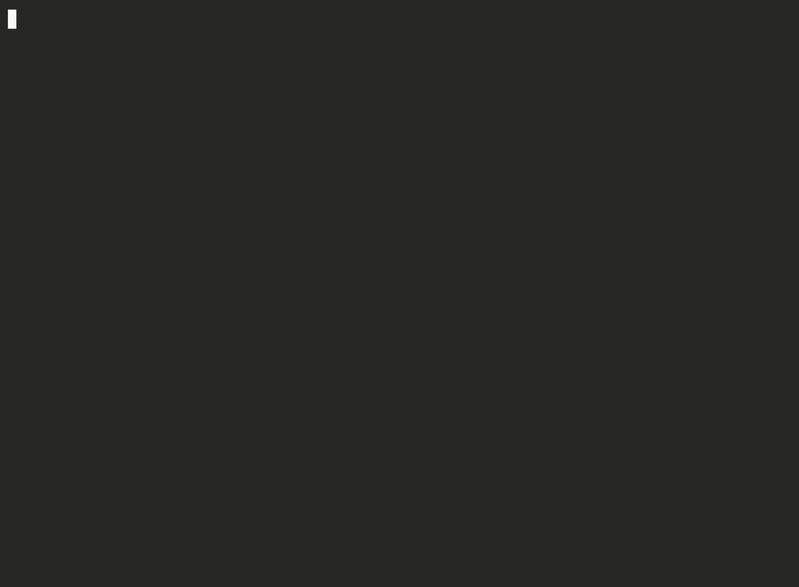
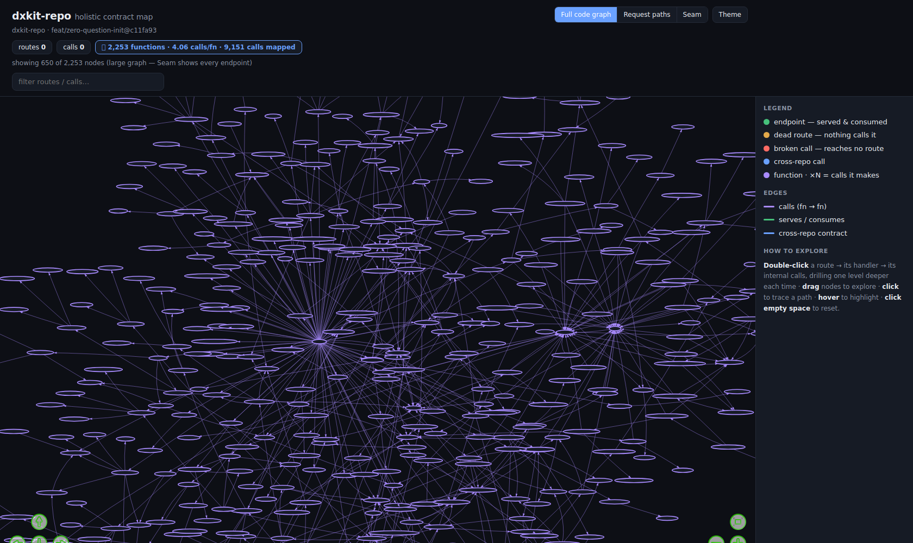

# dxkit

## A map before the edit. A real check before done.

**dxkit is the change-safety layer for AI coding agents: structural context
before the edit, and a deterministic stop-gate before the loop can finish.**

It maps the relevant code, callers, dependencies, and blast radius before the
agent edits. When an unattended loop tries to stop, it runs the compilation
and affected-test checks it can establish in that environment — anything it
cannot run is reported explicitly, never silently passed — plus the
configured detector-backed policy, and blocks if the change introduced a
prohibited regression.

Existing findings are baselined, not approved. The agent fixes what it
introduced, not years of unrelated debt. No model decides the gate verdict.

```text
BEFORE THE EDIT                     BEFORE STOPPING

Relevant code                       Compilation
Callers and dependencies      ->    Affected tests
Blast radius                        Net-new policy findings
Likely affected tests               Exact repair reason
```

<p align="center">
  
</p>
<p align="center"><sub>Recorded from a real run on a synthetic repository, shortened for readability. Blocked and repaired inside the same warm loop.</sub></p>

## Start in one command

From the root of the repository you want to gate:

```bash
npm init @vyuhlabs/dxkit -- --claude-loop --yes
```

That is the whole setup. dxkit reads your stack, wires the agent context, arms
the gates, installs the scanners a baseline needs, and captures today's
baseline, so the repository is gated on the very next change. No questions, no
homework. Undo anytime with `npx vyuh-dxkit uninstall`.

<p align="center">
  
</p>

Existing findings are grandfathered, not approved. Only what a change _adds_
from here can block. Already have dxkit installed? `init` detects the version
and points you at `npx vyuh-dxkit update` instead of re-running setup.

One honest cost note: the first baseline also records your repo's pre-existing
build/test state, which means running your build and full test suite once
(bounded; minutes on a large repository — `init` names the exact commands
before they run). Add `--no-floor` to defer that part to CI or a later
capture.

### Try it read-only on your own repository first

```bash
npx -y @vyuhlabs/dxkit@latest evaluate
```

`evaluate` writes nothing to your repository and installs nothing: it replays
your recently landed changes through the same gate `init` would arm and shows
what would have blocked, warned, or passed — evidence first, setup second.

### Want to see the gate first, without installing anything?

```bash
npx -y @vyuhlabs/dxkit@latest demo loop-guardrail
```

This stages a temporary fixture repo and runs the real gate on it: baseline,
introduce a net-new secret, block, repair, clean. Your repository is never
touched and no API key is needed. The demo needs gitleaks; without it, it
shows a clearly labelled illustration instead of pretending to scan.

### What the loop-safety benchmark observed

On controlled seeded-regression tasks, ungated agents frequently stopped while
configured guardrail findings remained:

| Loop condition            | Dirty stops observed |
| ------------------------- | -------------------: |
| Agent alone               |              11 / 16 |
| Agent + self-check prompt |               9 / 16 |
| Agent + dxkit Stop-gate   |  **0 / 16 observed** |

When dxkit blocked a stop, it returned the exact net-new finding to the active
agent, and the agent repaired it before stopping clean.
[Methodology, claim boundaries, and reproducible artifacts](docs/benchmarks.md).
The gate and the recorded fixtures replay offline without an API key;
reproducing the original agent runs requires the documented model environment.

dxkit also gates its own development. Its CI guardrail
[blocked PR #134](https://github.com/vyuh-labs/dxkit/pull/134) on real
findings (three files past the repo's size budget and a test fixture that a
broken benchmark run had leaked into the tree). The failed and passing runs
are in that PR's checks history. We fixed the findings, not the gate.

<p>
  <a href="https://www.npmjs.com/package/@vyuhlabs/dxkit"></a>
  
  
  
</p>

What you can rely on:

- **Deterministic verdict.** No model decides whether the gate passes: same
  input, same verdict, and the check does not grow as your baseline grows.
- **Brownfield-aware.** Existing detector findings are baselined; new policy
  findings block.
- **Change-scoped.** The graph identifies likely impact and helps select
  relevant context and tests.
- **Detector-neutral.** dxkit runs or ingests gitleaks, Semgrep, OSV, Snyk,
  CodeQL, and SARIF. It does not claim to out-detect them.
- **Warm-loop repair.** A blocked stop returns the exact finding while the
  agent still holds the task context.
- **Explicit failure states.** dxkit distinguishes a clean verdict from a
  skipped or unavailable check. A skipped detector is never reported as
  passed.

---

## See your code the way an agent should

`vyuh-dxkit describe` writes one self-contained HTML file: your whole code
graph (every function, what it calls, and what calls it) as a live,
draggable map. It runs read-only (nothing is written to your repository) and
needs no server or key.

<p align="center">
  
</p>
<p align="center"><sub>dxkit's own code graph, rendered by <code>describe</code>: 2,253 functions, 9,151 calls mapped. Drag, zoom, and double-click a function to drill into what it calls.</sub></p>

When a repository has an HTTP surface, `describe` **joins the code graph to the
contract** (every route, the calls that reach it, and the handler behind it)
and lights up the **seams**: dead routes nothing calls, client calls that reach
no route, and cross-repo contracts served by another repository in your
workspace. It is the map a coding agent (or a new teammate) reads to understand
a codebase and its integrations before touching it, and the same signals feed
the gate.

## How the change-safety layer works

An autonomous loop runs until the agent decides it is done. The checks it runs
along the way (tests, linters, CI-style commands) answer whether something is
broken or flagged. They do not, by themselves, answer the loop-level question:
did this change make the repository worse? dxkit adds that answer in four
steps:

1. **Map.** dxkit builds a structural code graph and hands the agent callers,
   callees, blast radius, and relevant files, so the change starts from
   structure instead of guesswork.
2. **Baseline.** `baseline create` records today's findings with durable
   fingerprints, so pre-existing issues stay visible and auditable without
   blocking the work.
3. **Gate.** On every unattended-loop stop attempt, a Claude Code Stop hook
   reruns the guardrail against that baseline: the compilation and
   affected-test checks it can establish (unavailable ones are reported,
   not silently passed), and the configured detector-backed policy.
4. **Repair.** If the change introduced a finding, the stop is blocked and the
   exact finding comes back to the agent while it still holds the task
   context. The loop finishes only when the change is clean.

When infrastructure fails (a scanner missing, a tool timing out), dxkit
reports that check as skipped rather than guessing. Real findings fail
closed; broken tooling never fabricates a verdict in either direction, and CI
remains the backstop.

The same deterministic core also runs outside the loop: a pre-push hook, a CI
guardrail, a six-dimension health report, and a set of Claude Code skills.
See [the docs](docs/README.md).

Use dxkit if you let coding agents run unattended or semi-attended, fix CI or
review comments in loops, or touch brownfield repos where new debt matters
more than all debt.

## Install options

The one-liner above is the default: it adds dxkit as a devDependency, installs
the Claude Code Stop hook, provisions scanners, and captures the baseline.
Everything is additive, preserving your existing `.claude` settings. Then run Claude Code
as you normally would; the Stop-gate fires on every stop of an unattended loop
(interactive sessions are not gated — review and the CI guardrail cover those).

```bash
npx vyuh-dxkit loop doctor            # verify the wiring
npx vyuh-dxkit loop ledger summarize  # what was blocked, allowed, and repaired
```

Variants:

- **Defer the baseline** (arm the gates now, scan later): add `--no-finish`,
  then run `npx vyuh-dxkit baseline create` when you are ready.
- **Pre-push + CI instead of the loop:** `npm init @vyuhlabs/dxkit -- --full --yes`.
- **Agent context only, no gate:** `npm init @vyuhlabs/dxkit -- --dx-only --yes`.

## What the gate checks

Two presets decide what blocks a stop:

```text
security-only  (default)  blocks net-new secrets, critical and high code
                          findings, critical dependency vulnerabilities, and
                          known-malicious packages at any severity. Every
                          other net-new finding warns; nothing net-new is
                          ever silent. Bounded, must-fix, cheap to gate.
full-debt      (opt-in)   also blocks net-new test gaps and maintainability
                          regressions. Repairs can be expensive.
```

Before the finding gate, a correctness floor runs: does the change still
compile or parse, and do the tests it affects still pass? A pre-existing
failure never blocks; a net-new one does.

The escape-rate benchmark above used `full-debt` (it gated both the secret
trap and the test-gap trap). The default install starts narrower so a first
run does not trap you in expensive test-generation loops. Switch with
`npm init @vyuhlabs/dxkit -- --claude-loop --loop-preset full-debt`.

## Why baseline-relative verification matters

Grandfathered does not mean accepted. It means attributed.

When an agent tries to declare done, the useful question is not "is this
entire repository debt-free?" It is:

> did this change make the repository worse than the baseline?

If the gate demanded zero findings repo-wide, brownfield teams could not
adopt it before a cleanup project, and the agent's repair target would be
unbounded: churned unrelated code, context spent on old debt, or a baseline
refresh to escape. dxkit scopes the obligation to the change: fix what this
branch introduced, do not touch unrelated debt, do not move the baseline.
Existing findings stay visible and auditable, and paying them down is a
separate, deliberate workstream. A baseline refresh is a governance action,
not a repair action.

This is also what the name means. dx as in calculus: the differential. dxkit
gates what a change does to your repo, not what your repo already was.

Baseline-relative verification only works if findings keep their identity
while code moves. dxkit fingerprints every finding so it survives line
shifts, file renames, and unrelated churn: old debt cannot masquerade as new,
and new debt cannot hide as old. The identity benchmark below measures
exactly this.

## Supported agents and detectors

**Agents.** The Stop-hook integration ships for Claude Code today. The
pre-push hook and the CI guardrail are agent-neutral and gate the change
whatever tool wrote it. Further agent adapters are planned, starting with
Codex.

**Detectors, universal on every repo:**

- secrets: gitleaks
- code patterns: Semgrep
- dependency advisories: OSV.dev
- size, duplication, and the code graph: cloc, jscpd, graphify

Per language, dxkit adds that ecosystem's own linter and audit tool. For
example, npm audit + ESLint (JS / TS), pip-audit + ruff (Python), govulncheck +
golangci-lint (Go), cargo-audit + clippy (Rust), `dotnet list --vulnerable`
(C#), osv-scanner + PMD (Java), osv-scanner + detekt (Kotlin), and
bundler-audit + RuboCop (Ruby). The full per-language matrix is in
**Languages** below.

For deep interprocedural analysis, dxkit ingests findings from **Snyk Code**
and **CodeQL** (or any SARIF file), fingerprints them the same way as native
findings, and runs them through the same baseline and gate. You keep the
detectors you already have; dxkit makes their findings enforceable inside CI
and inside the agent loop.

| Layer     | Examples                                               | Job                                                     |
| --------- | ------------------------------------------------------ | ------------------------------------------------------- |
| Detection | gitleaks, Semgrep, OSV, npm audit, Snyk, CodeQL, SARIF | Find issues                                             |
| dxkit     | baseline, fingerprint matcher, Stop-gate, loop ledger  | Decide whether this change introduced something net-new |
| Agent     | Claude Code or another coding loop                     | Repair the exact finding and try to stop again          |

**Where cloud scanners fit.** Use them; dxkit can ingest their findings. The
difference is tempo, not detection: cloud scanners run on a CI or PR cadence,
while a coding-agent loop needs a local stop decision every time the agent
tries to declare done.

| Loop Stop-gate need                                         | dxkit | Cloud or CI scanners                   |
| ----------------------------------------------------------- | ----- | -------------------------------------- |
| Runs locally on every unattended-loop stop, in seconds      | yes   | usually CI or cloud cadence            |
| Deterministic verdict, no model in the gate                 | yes   | varies (some add an LLM judge)         |
| Grandfathers existing debt                                  | yes   | tool-dependent                         |
| Feeds the exact block reason back to the warm agent session | yes   | usually a human-facing dashboard or PR |

### Extensions: your conventions, the same gate

Everything specific to your team plugs in as an extension, and the ladder
starts at zero code: declare a Postman collection, Pact contract, `.http`
file, or HAR capture in `flow.sources` and it joins the integration map like
extracted calls. Point a manifest at a script you already have, in any
language, and dxkit runs it at refresh time, validates its output, and routes
it through the same reporting and gating as native findings: your custom
scanner blocks PRs on net-new findings only, your screens-and-permissions
inventory trends in reports. For what only code can express, a small
TypeScript plugin ([`@vyuhlabs/dxkit-sdk`](packages/dxkit-sdk)) can teach the
flow extractor a bespoke HTTP client, read a custom contract format, or
assert over the gathered flow model. `vyuh-dxkit extensions init` scaffolds
either kind; `extensions dev` validates in seconds. See
**[the extension SDK docs](docs/extension-sdk.md)**.

## Languages

dxkit covers 10 ecosystems. Detection is automatic from your manifests and
source; each language brings its own native linter, dependency-audit tool, and
coverage parser, layered on the universal scanners.

Each capability also declares where it can execute: the host OS and SDK it
needs, and whether it must build the project. Stacks whose build is OS-locked
(a `net*-windows` WinForms target today; the same model covers Swift and
Android later) get an honest answer instead of a silent gap: the parts your
machine cannot run are disclosed with a remedy, a per-host CI gate job is
generated to run them, and the committed baseline is composed from captures
across those environments. See the execution-environment notes in
[init](docs/commands/init.md) and [checks](docs/commands/checks.md).

| Language                | Detected by                 | Native linter + audit                        |
| ----------------------- | --------------------------- | -------------------------------------------- |
| TypeScript / JavaScript | `package.json`              | ESLint, npm audit                            |
| Python                  | `pyproject.toml`, `*.py`    | ruff, pip-audit                              |
| Go                      | `go.mod`                    | golangci-lint, govulncheck                   |
| Rust                    | `Cargo.toml`                | clippy, cargo-audit                          |
| C# / .NET               | `*.csproj`, `*.sln`         | Roslyn analyzers, `dotnet list --vulnerable` |
| Java                    | `pom.xml`, `src/main/java/` | PMD, osv-scanner                             |
| Kotlin                  | `*.gradle{.kts,}`, `*.kt`   | detekt, osv-scanner                          |
| Ruby                    | `Gemfile`, `*.rb`           | RuboCop, bundler-audit                       |
| Swift                   | `Package.swift`, `Podfile`  | SwiftLint, osv-scanner                       |
| PHP                     | `composer.json`, `*.php`    | PHP_CodeSniffer, osv-scanner                 |

The correctness floor (does the change still compile, do its tests still
pass) runs on every pack through each language's own build and test
commands. Import resolution — the check that catches a dependency change
breaking module resolution — covers every interpreted pack:
TypeScript/JavaScript (node_modules), Python (the project venv +
declared manifests), Ruby (Gemfile.lock), and PHP (composer's autoload
maps). Compiled languages don't need it; their compiler is that check.
Per-test failure attribution is TypeScript/JavaScript-first (jest and
vitest output); other runners compare at whole-check level, and that
coarser comparison is disclosed, never silent.

<details>
<summary><strong>Per-pack capabilities</strong>: coverage import, import-graph, severity tiers (click to expand)</summary>

| Language | Detection                                 | Coverage import     | Import-graph                 | Native tools                        | Lint severity tiers    | Vuln severity tiers                           |
| -------- | ----------------------------------------- | ------------------- | ---------------------------- | ----------------------------------- | ---------------------- | --------------------------------------------- |
| TS / JS  | `package.json`                            | ✅ Istanbul         | ✅ import/require/re-export  | eslint, npm audit, vitest-coverage  | ✅ ESLint rule ID      | ✅ npm audit native                           |
| Python   | `pyproject.toml`, `setup.py`, `*.py`      | ✅ coverage.py      | ✅ import/from               | ruff, pip-audit, coverage           | ✅ ruff code prefix    | ✅ pip-audit + OSV.dev (CVSS v3+v4)           |
| Go       | `go.mod`                                  | ✅ coverprofile     | ✅ import blocks             | golangci-lint, govulncheck          | ✅ `FromLinter` family | ✅ govulncheck embedded + OSV.dev             |
| Rust     | `Cargo.toml`                              | ✅ lcov + cobertura | ✅ use statements¹           | clippy, cargo-audit, cargo-llvm-cov | ✅ clippy group        | ✅ cargo-audit native                         |
| C#       | `*.csproj`, `*.sln`                       | ✅ cobertura XML    | ✅ using declarations¹       | Roslyn analyzers (dotnet build)     | ✅ Roslyn code family² | ✅ dotnet list --vulnerable                   |
| Kotlin   | gradle/`*.gradle{.kts,}`, `*.kt`          | ✅ JaCoCo XML       | ✅ import statements¹        | detekt, osv-scanner (Maven)         | ✅ detekt severity     | ✅ osv-scanner + OSV.dev (Maven)              |
| Java     | `pom.xml`, `src/main/java/`, `*.java`     | ✅ JaCoCo XML       | ✅ import statements¹        | PMD, osv-scanner (Maven)            | ✅ PMD priority tiers  | ✅ osv-scanner + OSV.dev (Maven)              |
| Ruby     | `*.rb`                                    | ✅ SimpleCov JSON   | ✅ require/require_relative¹ | rubocop, bundler-audit, osv-scanner | ✅ rubocop severity    | ✅ bundler-audit + osv-scanner (Gemfile.lock) |
| Swift    | `Package.swift`, `Podfile`, `*.xcodeproj` | ✅ llvm-cov JSON    | ✅ SwiftPM target dirs       | swiftlint, osv-scanner (SwiftURL)   | ✅ SwiftLint rule tier | ✅ osv-scanner + OSV.dev (Package.resolved)³  |
| PHP      | `composer.json`, `*.php`                  | ✅ PHPUnit clover   | ✅ use/require¹              | phpcs, osv-scanner (Packagist)      | ✅ phpcs sniff tier    | ✅ osv-scanner + OSV.dev (composer.lock)      |

¹ For these packs dxkit extracts import statements without resolving them
to file-to-file links (that resolution needs per-build-system knowledge).
The only thing this affects is indirect test crediting: the Tests score can
run conservative — a file exercised only through a test's import chain may
still be listed as a gap. Gate verdicts, dependency-vulnerability
reachability, and the code graph behind `describe`/context are computed
from other sources and are unaffected. File-link resolution for these packs
is planned.

² C# lint severity tiers come from the Roslyn analyzer diagnostics
`dotnet build` emits: security analyzer families rank high,
design/compiler warnings medium, style low. A repo the SDK cannot build
(legacy .NET Framework projects) falls back to `dotnet-format`, whose
formatting violations count at `low` tier so they do not inflate the
Code Quality score.

³ Swift dep auditing covers SwiftPM (`Package.resolved`, OSV `SwiftURL`
ecosystem; needs osv-scanner ≥ 2.4.0). CocoaPods has NO advisory
database (OSV.dev carries no CocoaPods ecosystem), so a `Podfile.lock`
is disclosed as unaudited rather than reported clean. Xcode-project
builds (`xcodebuild`) are macOS-only; the correctness floor discloses
`skipped-environment` elsewhere and CI placement routes them to a
macos job.

</details>

## Evidence and benchmarks

Three benchmark studies, one theme: dxkit makes agent work more predictable.

| Layer                      | What it bounds                       | Observed result                                                                                                                     |
| -------------------------- | ------------------------------------ | ----------------------------------------------------------------------------------------------------------------------------------- |
| **Stop-gate**              | net-new detector-backed debt         | vanilla loops escaped **11/16** times, prompt-only checklist escaped **9/16**, dxkit escaped **0/16**                               |
| **Deterministic identity** | false "net-new" findings under churn | caught **all 3** seeded regressions with **0/2** false blocks on clean edits; **0 false net-new** on tested line shifts and renames |
| **Graph context**          | large-repo exploration tails         | median roughly tied, but large-repo mean tokens **30% lower**, worst case **57% lower**, variance roughly halved                    |

**Deferral has a re-orientation cost.** A fourth arm of the
loop-safety study measured the "detect on CI, fix later" model: on the test-gap
task, deferring a net-new finding to a cold session cost **~49% more in
equivalent cost** and **~51% more turns** than repairing it inside the warm loop,
because the cold fixer has to re-orient in a context it no longer holds. (The
secret-task premium pointed the same way but was weak (mean +19%, median
slightly negative), so we lean on the robust test-gap result.) So the gate is not
just safer than deferring, it is plausibly cheaper too.

**And the gate is fast enough to run on every unattended-loop stop.** dxkit scopes the
Stop-gate scan to the active preset's blockable finding kinds and re-scans only
the changed files, reusing cached results for everything unchanged. The verdict
is identical to a full scan; the cost is seconds per stop, not minutes, even on
large repositories.

> **Benchmark caveats:** the loop-safety study uses controlled synthetic tasks
> plus real-repo validation, detector-backed findings, and Sonnet runs. It is
> not a CVE corpus, not a claim of better detection, and not a guarantee that
> dxkit catches every possible bug. The claim is narrower: for findings the
> detector observes, dxkit gives the loop a deterministic net-new stop decision.

The deterministic results (the net-new gate decision and the finding-identity
matcher) replay offline with no API key, so you do not have to trust our
numbers. These harnesses live in `benchmarks/`:

```bash
node benchmarks/bench-guardrail.mjs config.json        # block/allow on seeded findings
node benchmarks/bench-netnew-isolation.mjs config.json # net-new isolation under churn
node benchmarks/bench-matcher.mjs config.json          # false net-new on line shifts + renames
```

See `benchmarks/README.md` to point them at a repo. The agent-driven harnesses
(loop safety, cost of deferral, gate-vs-LLM, and the graph-context sessions)
require the documented model environment and are published under
`benchmarks/agentic/`. Full methodology, the per-study reports, caveats, and
repro steps: **[docs/benchmarks.md](docs/benchmarks.md)**.

## Graph context

The Stop-gate reacts to a change; the graph shapes it. When dxkit scaffolds a
repo it builds a code graph and installs skills that drive development off
it, so the agent orients by querying structure instead of grepping and
re-reading whole files. The graph's job is specific to change safety:

- find the relevant code before editing,
- identify callers and dependencies,
- estimate blast radius,
- help select the likely affected tests,
- give the repair loop scoped context after a block.

Two skills drive it. `dxkit-feature` queries the graph for where a feature
plugs in, what patterns already exist, and what the change will touch, then
implements against those patterns. `dxkit-action` takes a flagged finding,
pulls its callers and blast radius, repairs it, and confirms the change did
not introduce something net-new. The agent gets the slice budget-bounded,
from the same graph, baseline, and identity contract the gate uses.

In our tested large-repository tasks, graph context primarily reduced
exploration variance and the expensive tail cases; it did not consistently
reduce median token usage. The worst-case session used about 57% fewer
tokens, variance was roughly halved, and on a small repo the overhead was
about zero. The graph scopes how the agent explores the repository; the
Stop-gate bounds what the configured policy allows it to finish with.

## Contributing

Contributions that widen the floor are especially welcome: agent adapters,
detector integrations, language packs, analysis fixtures, and
finding-identity cases.

- Contributing guide: [CONTRIBUTING.md](CONTRIBUTING.md)
- Ideas and plans: [GitHub issues](https://github.com/vyuh-labs/dxkit/issues)
- License: MIT

## Troubleshooting and advanced configuration

The agent-facing pieces (the skills like `dxkit-onboard` and `dxkit-fix`, the
Stop-gate, and "ask Claude to fix dxkit" guidance) activate when your agent
session is **rooted in the repo**, meaning it started from the repo
directory. Open your agent there, not in a parent folder.

The `demo loop-guardrail` command does a one-time `npx` download, so it is
not fully offline, though the gate itself is.

> **pnpm with a release-age policy?** If your `pnpm-workspace.yaml` sets
> `minimumReleaseAge`, a just-published dxkit is blocked until it ages in. Add
> the package to `minimumReleaseAgeExclude` first so the install resolves; this
> is your supply-chain policy, so dxkit does not edit that file for you.
>
> **Upgrading** on such a repo: keep the exclusion in place across the bump. If
> you swap a pinned old version for the new one _before_ installing, the stale
> lockfile entry violates the policy mid-install and can leave `node_modules` on
> the new version while your manifests still reference the old one (a broken
> bin). Exclude the package (not a version), run the upgrade, and you're done,
> no version juggling.

## Credits

dxkit stands on excellent open source tools. It orchestrates them, it does not
replace them. Thank you to the maintainers of
[graphify](https://github.com/safishamsi/graphify) (the code graph),
[gitleaks](https://github.com/gitleaks/gitleaks),
[Semgrep](https://github.com/semgrep/semgrep),
[OSV-Scanner](https://github.com/google/osv-scanner),
[jscpd](https://github.com/kucherenko/jscpd), and
[cloc](https://github.com/AlDanial/cloc). Each tool is installed separately and
keeps its own license.
